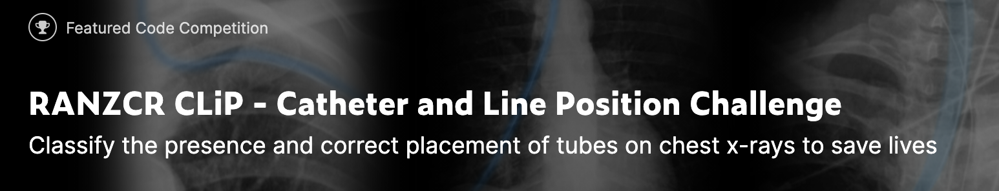

# RANZCR-CLiP

Kaggle diary for RANZCR CLiP competition

Kaggle diary for RANZCR CLiP - Catheter and Line Position Challenge

このリポジトリはRANZCR CLiPコンペのKaggle日記です。

##　コンペ情報
ざっくり言うとX線写真から、カテーテルの位置が正常であるかどうかを判断するというタスク 

Description(DeepL)
>深刻な合併症は、患者のラインやチューブの位置を間違えた結果として発生する可能性があります。医師や看護師は、患者を管理する際にプロトコルに従っていることを>確認するために、救命器具を配置するためのチェックリストを頻繁に使用しています。しかし、これらの手順には時間がかかることがあり、特に病院の収容人数が多いス>トレスの多い状況では、人為的なミスが発生しやすい。
>
>入院患者は入院中にカテーテルやラインを挿入されることがありますが、位置を誤ると重篤な合併症を引き起こす可能性があります。経鼻胃管の気道内への位置ずれは、>症例の最大3％で報告されており、これらの症例の最大40％が合併症を示しています[1-3]。手術室外で挿管された成人患者の気道チューブの位置異常は、最大25％の症>例で報告されています[4,5]。合併症の可能性は、手技者の経験レベルと専門性の両方に直接関係している。位置がずれたチューブを早期に発見することは、危険な合併>症（死に至ることもある）を防ぐ鍵であり、何百万人ものCOVID-19患者がこれらのチューブやラインを必要としている現在ではなおさらである。
>
>ラインとチューブの位置を確認するためのゴールドスタンダードは胸部X線写真である。しかし、医師や放射線技師は、ラインやチューブが最適な位置にあるかどうかを>確認するために、これらの胸部X線写真を手動でチェックしなければならない。これはヒューマンエラーの可能性を残すだけでなく、放射線技師は他のスキャンの報告に>忙しくなるため、遅延が生じることもよくあります。ディープラーニングアルゴリズムは、カテーテルやラインの位置が間違っていることを自動的に検出することができ>るかもしれない。警告が出れば、臨床医は命に関わる合併症を避けるために、カテーテルの位置を変更したり、除去したりすることができる。
>
>Royal Australian and New Zealand College of Radiologists（RANZCR）は、オーストラリア、ニュージーランド、シンガポールの臨床放射線技師と放射線>腫瘍医のための非営利の専門組織である。RANZCRは、不適切な位置に置かれたチューブやラインを予防可能なものとして認識している世界の多くの医療機関（NHSを含>む）の一つである。RANZCRは、そのようなエラーがキャッチされる安全システムの設計を支援しています。
>
>このコンペティションでは、胸部X線写真上のカテーテルやラインの存在と位置を検出します。機械学習を使用して、40,000枚の画像上でモデルをトレーニングしてテス>トし、不適切な位置にあるチューブを分類します。
>
>データセットには、ラベル付けとの整合性を確保するために、一連の定義でラベル付けを行いました。正常カテゴリには、適切に配置され、再配置を必要としない線が含>まれます。境界線のカテゴリには，理想的には多少の再配置を必要とするが，ほとんどの場合，現在の位置でも十分に機能するであろう線が含まれる．異常カテゴリーに>は、直ちに再配置を必要とするラインが含まれる。
>
>成功すれば、臨床医の命を救うことができるかもしれない。COVID-19の症例が急増し続ける中、位置がずれたカテーテルやラインを早期に発見することはさらに重要で>ある。多くの病院では定員に達しており、これらのチューブやラインを必要としている患者が増えています。カテーテルやラインの配置に関する迅速なフィードバック>は、臨床医がこれらの患者の治療を改善するのに役立つ可能性がある。COVID-19以外にも、ラインやチューブの位置を検出することは、多くの病 院患者にとって常に必>要なことである。

らしいです。11つの状態について二値分類を行い、ROC curve の面積の大きさを評価指標として用いる。

## team
solo(team mergeしたことない...)
## timeline
2/24　joined 
3/16  close
## 目標
金　上位11 
銀　上位50 
銅　上位100

銅メダルをとってexpertになりたいが、今後のこと(masterになる)も考えると銀メダルを取りたいという。

### 2/24
***
公開カーネルを提出(0.965)
resnext50_32x4dとefficientnet_b4で学習を回した。(本当はtf_efficientnet_b4で学習するつもりだった...)ROCスコアは、resnext50_32x4dが94%ほどで、中々悪くない結果であったが、リーダーボードを見る感じ、もっと高いスコアが必要そう。(というか公開カーネルがあるとはいえ、LB団子になりすぎじゃね？)
一方でefficientnetは、84%と、そこまで良いスコアだと言えなかった。
さらに、画像サイズを600として学習したため、学習時間が長かった(どちらもepoch10までたどり着かなかった)

<a href="log/ranzcr-training-resnext.log">resnext50_32x4dのログ</a> 
<a href="log/ranzcr-training-efficientnet.log">efficientnet_b4のログ</a> 
### 2/25
***

